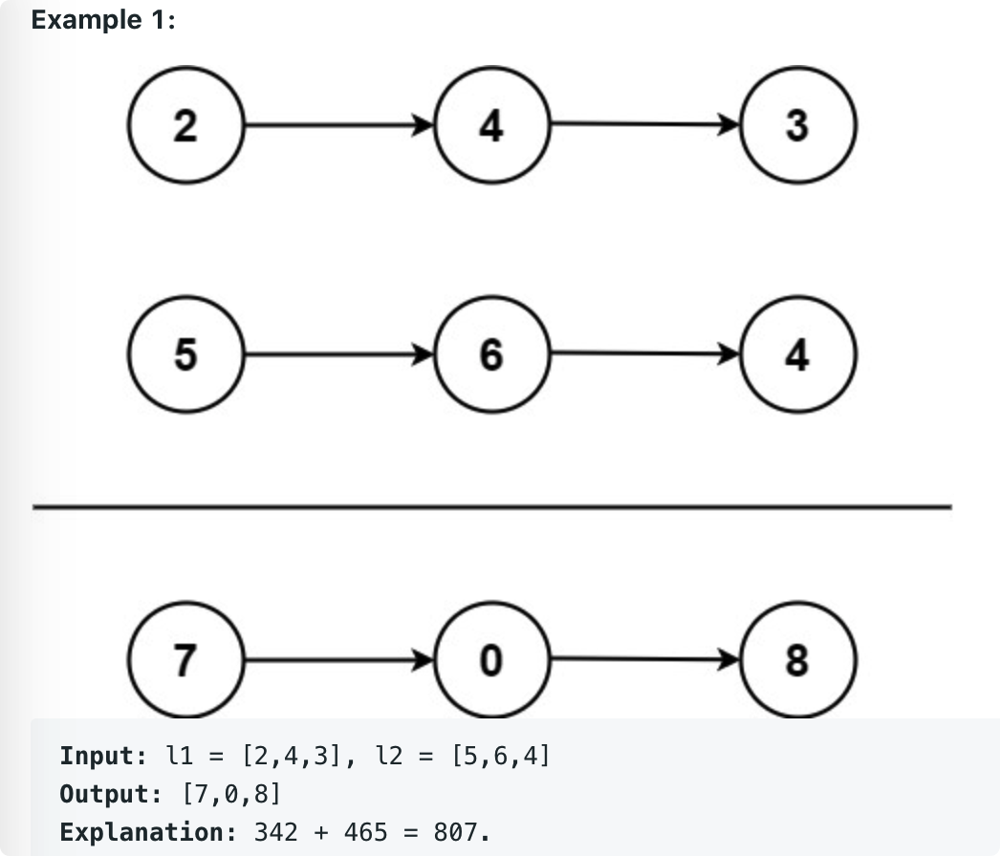

# leetcode t2
- 2个整数链表对应元素求和问题
- 给定2个整数链表，链表顺序是实际整数的逆序
- eg， 
    - l1 = [2,4,3], l2 = [5,6,4]，return [7，0， 8]
        - 
    - l1 = [9,9,9,9,9,9,9], l2 = [9,9,9,9]，return [8,9,9,9,0,0,0,1]
    
# 思路
- 如果先遍历list，把list元素转为整数，会有整数溢出的问题，因为list可以无限长
- 遍历2个list时分别进行对应元素相加
    - 注意2个list长度不相等时，分别处理
    - 使用进位标记
    - 遍历结束时注意判断进位是否为1
    - 使用dummy节点标记新链表头结点的前导节点，使返回dummy.next就是新链表的头结点