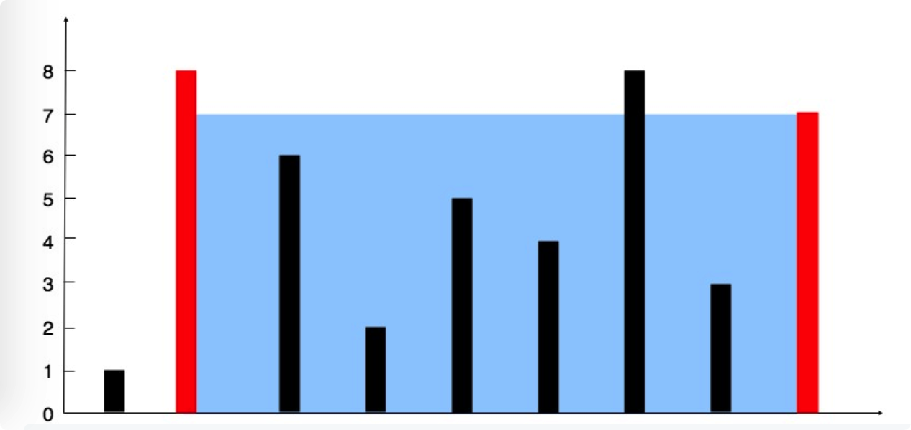

# leetcode t11
- 整数数组中，2点与横轴围成的凹槽的最大面积
- 数组值是非负整数
- eg， 
    - height = [1,8,6,2,5,4,8,3,7], return 49
    - 
    

        
# 思路1
- 是用2层循环，确定2个点，凹槽面积是min(a, b) * 两点距离
- 时间复杂度O(n^2), 空间复杂度O(1)

# 思路2，双指针遍历
- 使用左右两个指针l, r从两边往中间遍历
- 那边的元素小，就移动那边的元素，因为如果移动大的元素往中间靠拢，结果只会更小，因此移动小的元素，找可能的最大值
- 每次计算的面积相当于是待移动位置元素的面积，不一定是该位置的最优解
- 每次移动都在找可能的最大值
- 时间复杂度O(n), 空间复杂度O(1)
