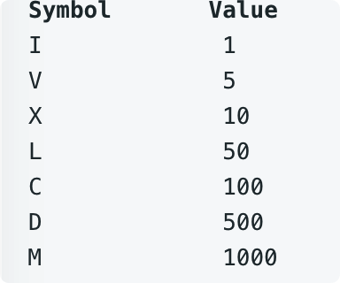
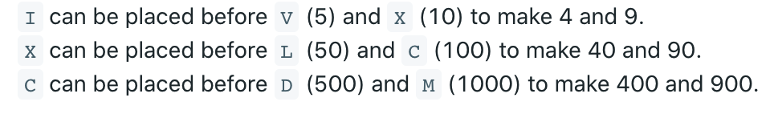

# leetcode t12 本题不属于高频题
- 数字转罗马数字
- 输入数字范围1~3999
- 罗马数字单位
    - 
- 几个特殊规则
    - 
- eg， 
    - num = 3, return "III"
    - num = 58, return "LVIII"
    - num = 1994, return "MCMXCIV"
    

        
# 思路1
- 从大的单位往晓得单位遍历，因此对单位取模，得到当前单位拼接字符串的数量
- 需要先对特殊字符进行处理，如4，9等

# 思路2
- 由于题目给定的数字范围是3999，可以建立每个十进制位上的数字与罗马字符的对应关系
- 使用空字符串代替0
- 查表得到对应字符串
