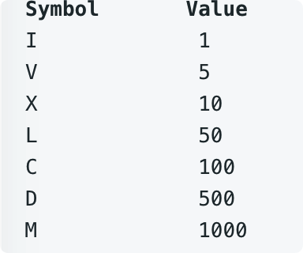
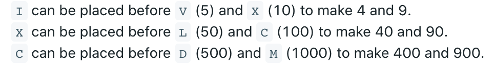

# leetcode t4
- 罗马数字转数字
- 输入数字范围1~3999
- 罗马数字单位
    - 
- 几个特殊规则
    - 
- eg， 
    - s = "III", return 3
    - s = "LVIII", return 58 
    - s = "MCMXCIV", return 1994
    
        
# 思路
- 建立每个字符对应数字的hashmap，注意添加4，9等特殊字符
- 遍历字符串，先判断连续2个字符串是否有效，再判断当前字符串是否有效

