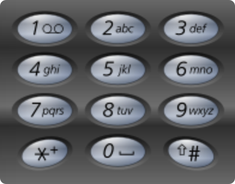

# leetcode t17
- 9宫格字母组合
- 给定一个数字字符串，返回所有可能的字母组合
- 9宫格映射
    - 
- 输入数字字符串在2~9之间，输入字符串也可能为空

# 思路
- 递归实现
- 设计递归函数f(String s, int index, String tmp, List<String> result)
    - index表示当前从左往右已经处理到第几个字符串了
    - tmp表示已经处理的字符串生成的组合
- 递归终止条件
    - index == str.length，把tmp加入result中, 返回
- 时间复杂度最大为O(4^n)，假设数字都是9，空间复杂度O(n)
