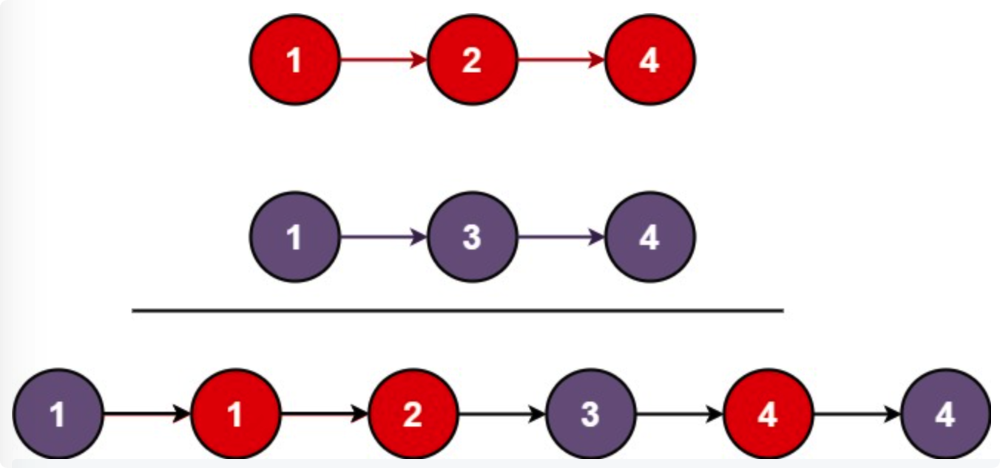

# leetcode t21
- 给定2个整数链表，链表各自有序，重新按栈从小到大顺序把链表连起来
- eg， 
    - l1 = [1,2,4], l2 = [1,3,4], return [1,1,2,3,4,4]
        - 
        
# 思路
- l1 == null, return l2
- l2 == null, return l1
- 当2个链表都不为null时，拼接排序
- 最后检查 l1==null, 把l2剩下的节点拼接上
- 最后检查 l2==null, 把l1剩下的节点拼接上
- 使用dummy节点作为新链表头结点的前导节点
- 时间复杂度O(n)，空间复杂度O(1)
