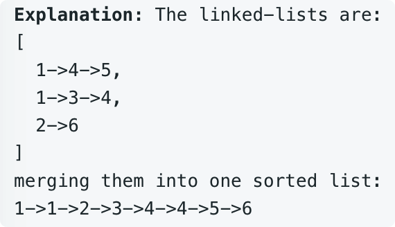

# leetcode t23
- 合并k个有序链表
- 输入链表可以为空
- eg， 
    - 
        
# 思路1
- 将有序链表拆分为依次合并2个有序链表，合并以后的链表再和新的第3条链表合并
- T21是合并2个有序链表的算法，时间复杂度O(n), n是2个链表的总长度
- 使用dummy节点表示合并后生成链表的头结点的前导节点
- 假设链表平均长度为m，链表个数为k，链表总长度 n = k * m
- 每次合并一个链表时间复杂度O(2m),依次合并的时间复杂度总和 O(2m) + O(3m) ... + O(km) = O(k^2 * m) = O(k * n)
- 时间复杂度，O(k * n)，空间复杂度O(1)
- java实现耗时112ms

# 思路2
- 利用归并排序的思想，将原链表二分，先局部两两合并，再全部合并
- 实现归并排序，二分递归函数f(ListNode[] lists, int l, int r)
    - lists 原链表数组
    - l表示数组左边界
    - r表示数组右边界
    - l == r时，递归终止条件，返回lists[l]
- T21是合并2个有序链表的算法，时间复杂度O(n), n是2个链表的总长度
- 使用dummy节点表示合并后生成链表的头结点的前导节点
- 归并排序总共二分log(k)次，每次处理的时间复杂度是O(n)
- 时间复杂度，O(n * log(k))，空间复杂度O(log(k))
- java实现耗时1ms

# 思路3
- 利用大小为k的最小堆实现，每次把k个链表的一个元素加入最小堆，弹出堆顶元素的最小值，然后把该值的下一个节点加入最小堆，重复这个过程
- 堆加入和弹出一个元素的时间复杂度是O(log(k)), 总共处理n次
- 时间复杂度，O(n * log(k))，空间复杂度O(k)
- java实现耗时4ms

