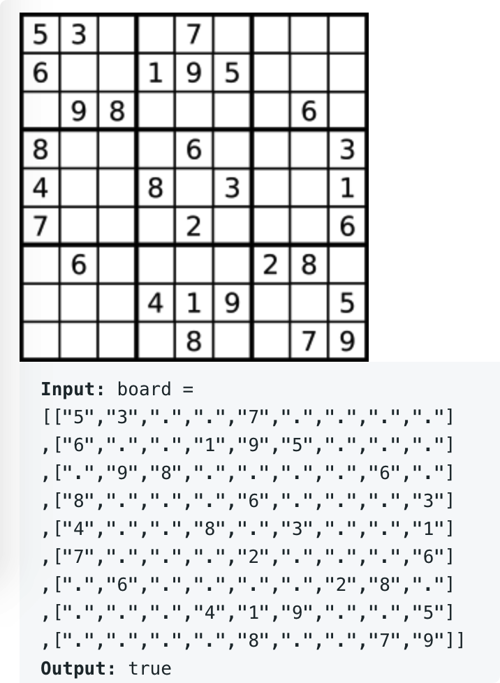

# leetcode t36
- 给定9 X 9的数独矩阵，矩阵中有部分数字以给出，判断已经给出的数字是否能构成有效数独
- 数独规则
    - 每行的数字是0~9，无重复
    - 每列的数字是0~9，无重复
    - 每个小的九宫格数字是0~9，无重复
- eg， 
    - 
    
# 思路
- 准备3个矩阵，存储这3个条件
    - 行条件
        - boolean[][] = new boolean[9][9] 
        - 第一个9代表9行，第二个9代表没行里1~9这9个数字是否出现过
    - 列条件
        - boolean[][] = new boolean[9][9] 
        - 第一个9代表9列，第二个9代表没行里1~9这9个数字是否出现过
    - 小九宫格条件
        - boolean[][] = new boolean[9][9] 
        - 第一个9代表9个小九宫格，第二个9代表没行里1~9这9个数字是否出现过
- 使用2重循坏，遍历依次矩阵，检查每个元素是否违反这3个条件
- 时间复杂度O(81), 空间复杂度O(81)
