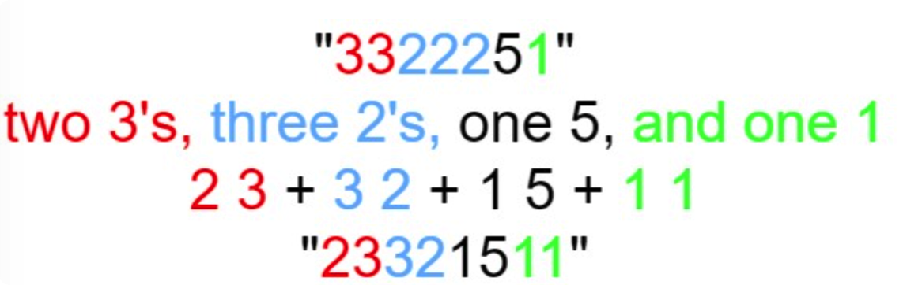

# leetcode t38
- 每个数字按照连续都少个数字拆分并拼接起来
- 输入数字n，给出对应的拼接后的字符串
- 数字拆分规则
    - 
- eg,
    - n = 1, return "1"
    - n = 2, return "11"
    - n = 3, return "21"
    - n = 4, return "1211"
    - 当前n是对n-1的将诶鬼进行拆分得到的
    
# 思路
- 从1开始遍历到n，先得到n-1的结果，再利用n-1的结果得到n的结果