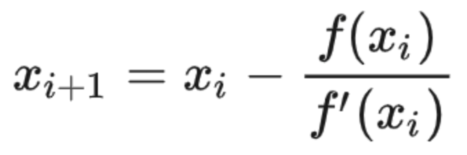

# leetcode t66
- 求解平方根取整
- eg
    - x = 8, return 2

# 思路1
- 在0~x上使用二分查找进行求解
- x^2可能会超过int最大值，计算平方时使用long值
- 时间复杂度O(log(N)), 空间复杂度O(1)

# 思路2
- 使用牛顿迭代法求解
- 牛顿迭代法求解的是f(x) = 0的近似解
    - 原理：https://oi-wiki.org/math/newton/
    - 使用切线与x轴的交点不断迭代x
    - x迭代公式 
- 这里的方程是 x^2 - n = 0, f'(x) = 2x, 迭代公式x' = (x + n / x) / 2
- 初始时，令x = n，逐步迭代，直到x^2 <= n
- 时间复杂度O(log(N)) , 因为每次迭代x都会除以2， 空间复杂度O(1)