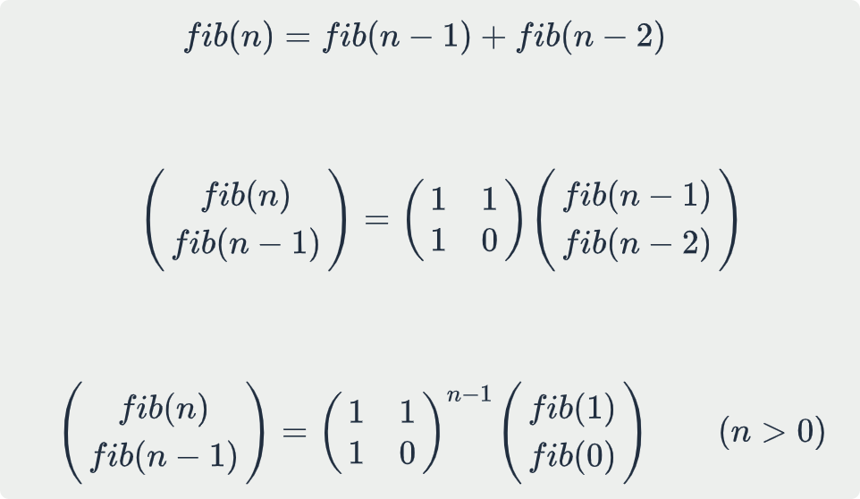

# leetcode t70
- 爬楼梯方法数
- 给定正整数n，代表楼梯层数，初始位于第0层，每次向上走一步或者两步，求到达第n层的方法数
- eg
    - n == 3, return 3

# 思路1
- dp， dp[i]表示到达第i层的方法数
- 递推公式dp[i] = dp[i-1] + dp[i-2]
- 时间复杂度O(N), 空间复杂度O(N)

# 思路2
- 压缩思路1中的空间
- 使用2个变量分别记录dp[i-1] 和 dp[i-2]，滑动更新
- 时间复杂度O(N), 空间复杂度O(1)

# 思路3
- 把斐波拉切递推关系式用矩阵递推关系式表达出来
    - 
- 图中矩阵的n次方可以使用快速幂实现
- 时间复杂度O(log(N)), 空间复杂度O(1)
