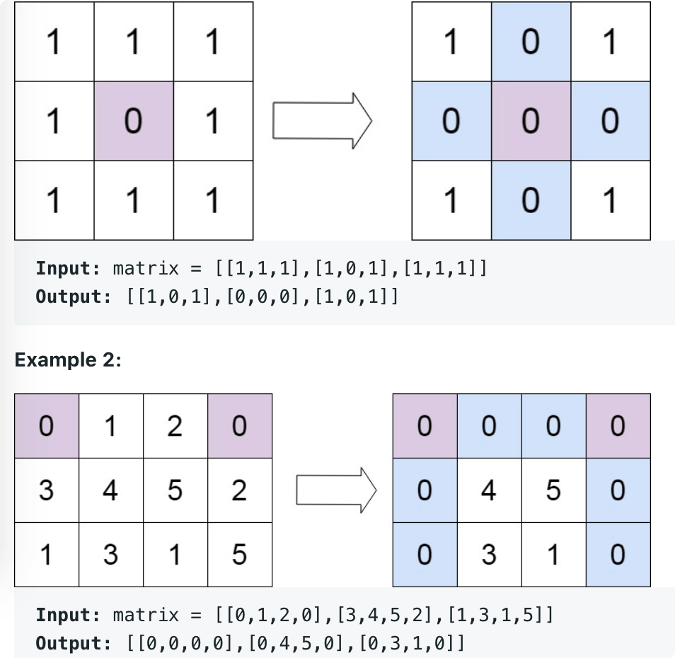

# leetcode t73
- 给定一个整数矩阵，如果matrix[i][j]==0, 就把第0行和第j列的元素都置0
- eg
    - 

# 思路1
- 使用行数组和列数组标记是否置0
- 先遍历一遍矩阵，填充标记数组
- 再遍历矩阵，根据标记数组置0
- 时间复杂度O(m*n), 空间复杂度O(m+n)

# 思路2
- 使用第0行和第0列充当标记数组
- 先遍历第0行和第0列，看原始矩阵第0行和第0列是否有0
- 再遍历矩阵，填充标记数组
- 再遍历矩阵，根据标记数组置0
- 最后看第0行和第0列是否置0
- 时间复杂度O(m*n), 空间复杂度O(1)