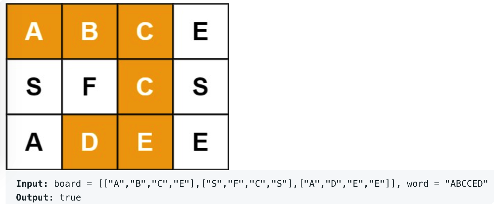

# leetcode t79
- 在矩阵中查找单词是否出现过
- 给定矩阵和单词只包含小和字母和大写字母
- 矩阵中不能走重复路径
- eg
    - 

# 思路1
- 遍历矩阵，依次从每个位置递归匹配word
- 递归函数中往上下左右四个方向扩展，进行匹配
- 由于不能走重复路径，需要使用二维数组记录每个位置是否到达过
- 时间复杂度上界O(m*n*4^k), m, n是矩阵维度，k是word的长度

# 思路2
- 和方法1中的思路一致
- 由于不能走重复路径，这里不在使用微微数组标记是否走过，而是把走过的路径的值全部改为字符'0'，这样到达重复位置，匹配失败，直接返回
- 时间复杂度上界O(m*n*4^k), m, n是矩阵维度，k是word的长度