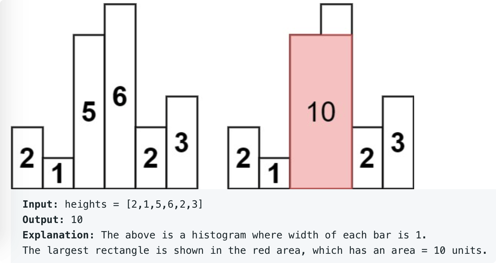

# leetcode t84
- 数组中的最大面积
- 给定数组包含正数和0，求与x轴围成的最大矩形的面积
- 矩阵中不能走重复路径
- eg
    - 

# 思路1
- 遍历数组，以当前点为中心扩展出去，求得当前点的最大面积
- 遍历完所有点时，得到整个数组的最大面积
- 时间复杂度O(N^2), 空间复杂度O(1)
- java实现超时

# 思路2
- 使用严格单调递增的单调栈，栈中存放数组的索引
- 遍历数组，当前元素>栈顶元素，直接入栈
- 当前元素<=栈顶元素，一直出栈，直到当前元素>栈顶元素
- 出栈时，结算栈顶元素对应的面积，当前位置是栈顶元素右侧最近的比他小的，栈顶的下一个位置是左边最近的比他小的
- 时间复杂度O(N), 空间复杂度O(N)
- java实现25ms

# 思路3
- 思路和方法2一致
- 使用数组代替栈， 用变量标记数组的有效长度
- 时间复杂度O(N), 空间复杂度O(N)
- java实现5ms
