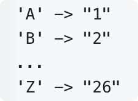

# leetcode t91
- 数字解码成字母的方法数
- 给定一个包含0和正整数的字符串，根据对应的关系解码成字母串，求所有的方法数
- 数字和字母的对应关系
     - 数字和字母是严格对应的，数字01不能代表A，1代表A
     - 
- eg
    - s = "12"，return 2

# 思路1
- 使用递归函数，考虑当前值到结尾的方法数，当前值的情况
- 情况1，当前值时0，return 0
- 情况2，当前值是1~9，只使用当前的一个字符，继续向下匹配
- 情况3，当前值是1，下一个值是0~9，使用2个字符，继续向下匹配
- 情况4，当前值是2，下一个值是0~6，使用2个字符，继续向下匹配
- 所有情况的和就是当前位置到数组结尾方法数
- java实现超时

# 思路2
- 思路和方法1一致
- 方法1中有很多重复的递归调用，可以使用数组进行缓存
- java实现耗时1ms

# 思路3
- 动态规划，dp[i]表示i...end匹配的方法数
- 时间复杂度O(N), 空间复杂度O(N)
- java实现耗时1ms

# 思路4
- dp[i]依赖于dp[i+1]和dp[i+2], 使用2个变量即可更新
- 时间复杂度O(N), 空间复杂度O(1)
- java实现耗时1ms
