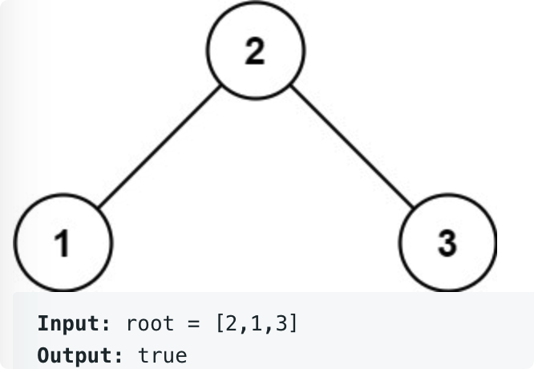

# leetcode t98
- 判断是否搜索二叉树
- 搜索二叉树定义
    - 根节点的左孩子值严格小于根节点的值
    - 根节点的右孩子值严格大于根节点的值
    - 根节点的左右子树也是搜索二叉树
- eg
    - 

# 思路1
- 方法1
- 看递归中序遍历结果是否是递增的
- 时间复杂度O(N), 空间复杂度O(N)

# 思路2
- 递归遍历每个节点，把每个节点当父节点，查看是否BST
- 每个节点需要返回3个信息：是否BST, 最小值，最大值
- 时间复杂度O(N), 空间复杂度O(h), h是树的高度

# 方法3
- 从上往下遍历，每个节点在遍历过程中的边界范围会受限制，查看当前节点是否在[min, max]范围内，并迪许递归左右子树
- 往左遍历时，max更新为当前值
- 往右遍历时，min更新为当前值
- 根节点没有范围下限值，min=null，max=null
- 时间复杂度O(N), 空间复杂度O(h), h是树的高度