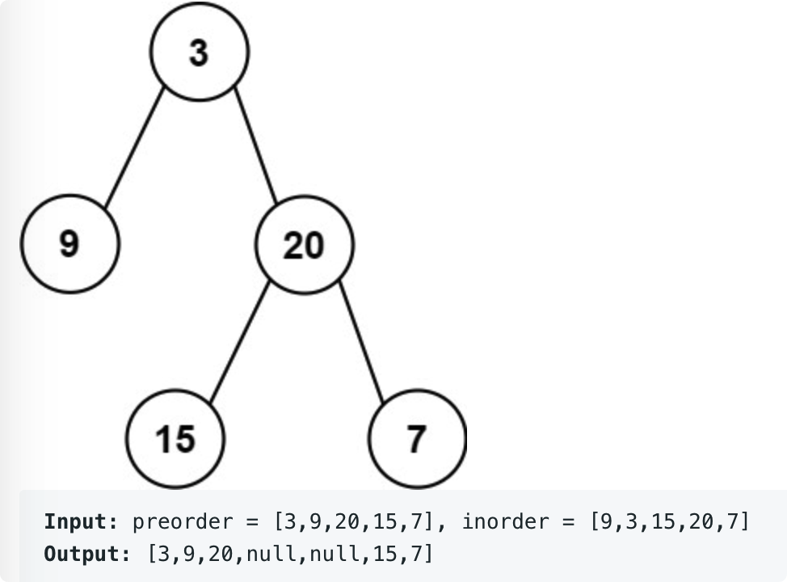

# leetcode t105
- 给定先序和中序遍历数组，根据先序和中序遍历重建二叉树
- 数组中不包含重复元素
- eg
    - 

# 思路
- 先序遍历数组的构成  head, left tree, right tree, 设计递归函数，递归处理left tree， right tree
- 中序遍历数组构成 left tree, head, right tree
- 在先序数组中确定head，然后再中序数组中找到head的位置，就可以计算出左树的长度和右树的长度
- 确定左树和右树的在先序遍历的数组索引范围后，继续在先序数组中遍历左树和右树
- 时间复杂度O(N), 空间复杂度O(N)的高度