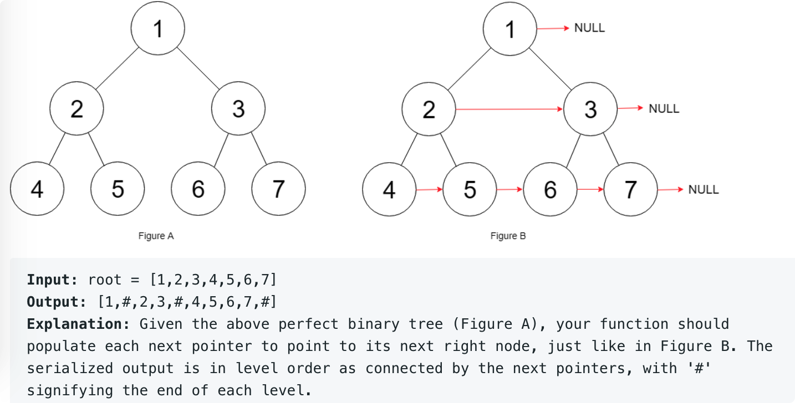

# leetcode t116
- 给定一棵满二叉树，二叉树节点带有next指针，要求next指向同层右边的位置，构建next指针
- eg
    - 

# 思路1
- 层序遍历二叉树，加入队列时，先加入右节点，再加入左节点
- 时间复杂度O(N), 空间复杂度O(N)空间复杂度O(log(N))，建立的树接近于完全二叉树，高度为log(N)

# 思路2
- 深度递归遍历二叉树
- 当前节点的左孩子next指向右孩子，当前节点的右孩子的指针指向当前节点next的左孩子
- 时间复杂度O(N), 空间复杂度O(log(N))

# 方法3
- 由于node带有next指针，可以不使用队列，层序遍历二叉树
- 在当前层处理此下一层的next指针
- 时间复杂度O(N), 空间复杂度O(1)