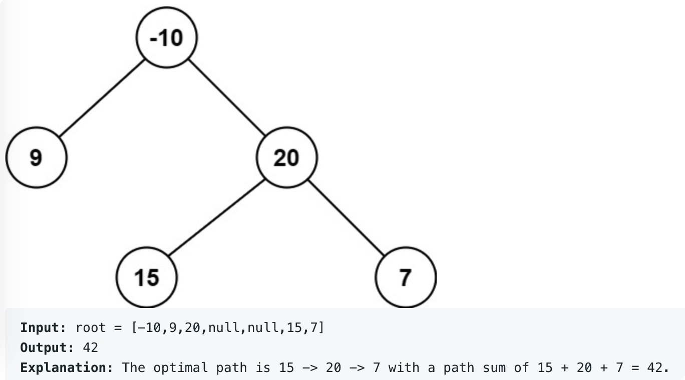

# leetcode t122
- 二叉树的最大路径和
- 给定正数，负数，0组成的二叉树，求最大路径和
- eg
    - 

# 思路
- 递归遍历左右子树，返回节点信息，节点子树上的最大路径值，节点子树从head出发的最大路径值
- 当前节点为头结点的情况
- 情况1: 最大值不经过头结点，是左子树的最大值
- 情况2: 最大值不经过头结点，是右子树的最大值
- 情况3: 最大值只有头结点
- 情况4: 最大值是头结点出发的向左边的
- 情况5: 最大值是头结点出发的向右边的
- 情况6: 最大值是头结点结合左边的一部分和右边的一部分
- 时间复杂度O(N), 空间复杂度O(h), h是树的高度复杂度O(1）