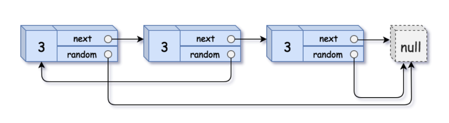

# leetcode t138
- 复带有随机指针的链表
- 给定链表节点包含随机指针，随机指针可能指向节点，也可能指向null，复制整个链表
- eg
    - 

# 思路1
- 先复制链表，不指定随机指针
- 使用map记录新旧节点的映射关系
- 再同步遍历原始链表和新链表，通过map找到随机指针指向的新节点，给新链表随机指针赋值
- 时间复杂度O(N), 空间复杂度O(N)

# 思路2
- 先复制链表，把新节点插到原节点的后面，方便通过原节点找到新的随机指针
- 赋值随机指针，旧链表随机指针指向的下一个节点就是新的随机指针节点
- 最后把新链表从原始链表中拆解出来
- 时间复杂度O(N), 空间复杂度O(1)