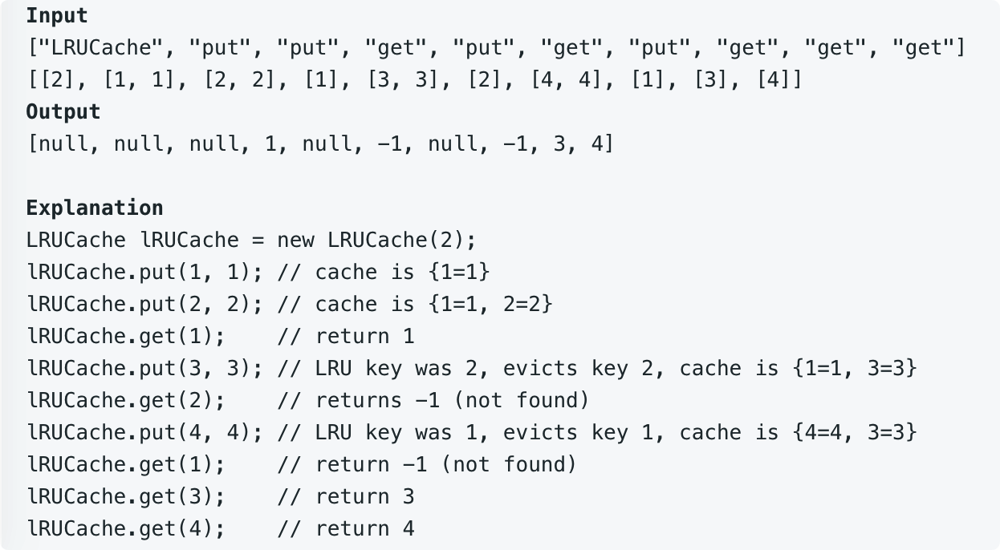

# leetcode t146
- LRU
- 设计LRU缓存
    - 给定缓存的容量
    - get是返回key对应的val， 不存在返回-1
    - put时，如果key存在，就更新val，否则新加key
    - 如若put时，容量超了，需要删除最不经常使用的key，然后再put
- 给定的容量是正数
- get， put操作时O(1)复杂度
- eg
    - 

# 思路
- 使用双端队列按最近的操作存储，节点包含key，val
    - 队列头是最近操作的，队列尾是最不经常操作的
    - 双端队列可以快速找到当前节点的前一个节点和后一个节点
    - 双端队列包含尾指针，可以方便你的删除尾结点
- 使用HashMap存储 key -> Node的映射
- 如图
    - 
- get实现
    - 从map中查找key对应的节点，返回节点的val，同时把节点移动到头部
- put实现
    - 从map中查找key对应的节点，如果存在，更新val，同时把节点移动到头部
    - map中不存在key，新建节点
        - 如果容量超标，删除尾部元素
        - 不超标操作
        - 把新节点添加到头部
- 双端队列要实现的功能
    - 把节点移动到头结点
        - 如果已经是头结点，不操作
        - 如果是把尾结点移动到头结点，先把尾结点从原链表中拆分出来，更新尾结点
        - 如果是中间节点，先把中间结点从原链表中拆分出来
        - 最后把拆分出来的节点移动到头结点，更新头节点
    - 添加新节点到头结点
        - 如果头结点是空，头结点和尾结点都指向当前节点
        - 头结点不是空，添加当前节点到头结点，更新头结点
    - 删除尾节点
        - 如果链表中只有一个节点，删除后，头结点和尾节点都是null
        - 否则，删除尾结点，更新尾结点
