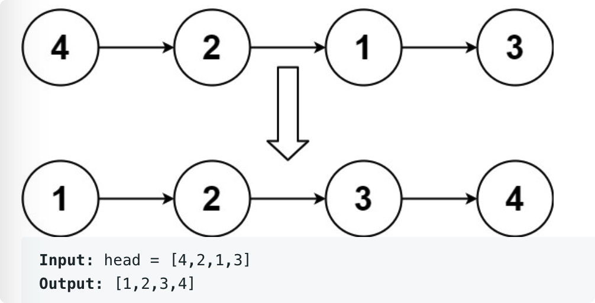

# leetcode t148
- 排序链表
- eg
    - 

# 思路1
- 快排
- 使用partition过程，利用链表第一个元素作为pivot，划分为<=pivot的在左边，>pivot的在右边
- 时间复杂度O(N*log(N)), 空间复杂度O(N)
- 由于每次使用第一个元素作为pivot，如果原始链表大部分是有序的，时间复杂度会变为O(N^2)
- java实现耗时1800ms

# 思路2
- 归并排序
- 先找到中位点mid，把mid.next开始的右半部分排序，返回排序号后的新头节点
- 再把mid.next = null, 把mid结束的左半部分排序，返回排序号后的新头节点
- 时间复杂度O(N*log(N)), 空间复杂度O(log(N))
- 归并排序，每次找到中位点，搞定一半的元素，时间复杂度严格是O(N*log(N))， 并且递归深度不会超过O(log(N))
- java实现耗时6ms