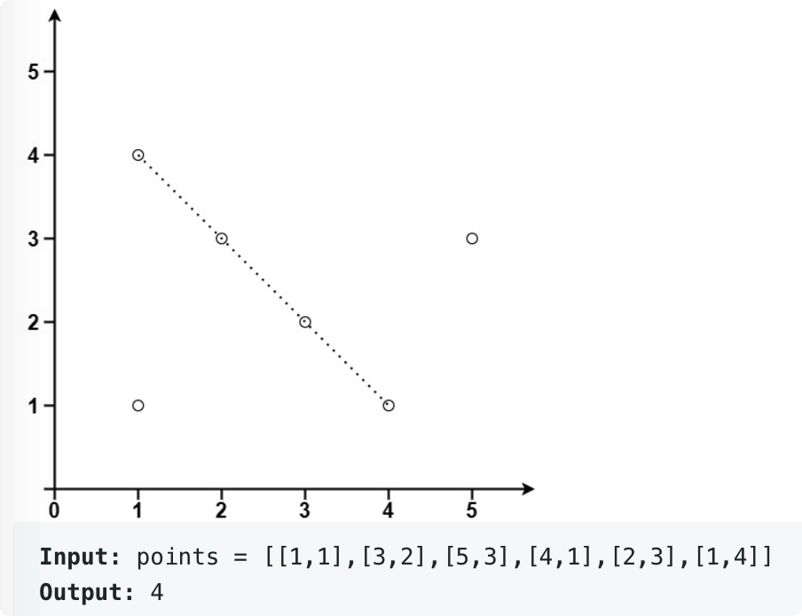

# leetcode t149
- 共线的点最多的数量
- 给定一个整数数组，统计共线的点的数量
- 数组的点不重复
- eg
    - 

# 思路1
- 2点确定一条直线，然后看剩下的点在不在直线上
- 使用i, j索引确定一条直线，j=i+1...，看以k为索引的点在不在直线上， k = j+1...
- 如果点i和点j重复，跳过点j，直到找到一个和点i不同的点j
- 共线判断
    - (y3 - y1) / (x3 - x1) = (y2 - y1) / (x2 - x1), 除法转换为乘法，避免除以0的问题
    - 当delax或者deltay等于0时，点i和点j确定的直线与x轴或者y轴平行，上述判断公式也兼容
- 如果不同的点i和点j确定的直线重复，那么前面的直线统计到的点数会覆盖掉后面的直线，不会影响结果
- k为什么不从0开始，而是从j+1开始
    - 如果i和j确定的直线没出现过，那么j之前的点不会在该条直线上，k就会从j+1开始遍历
    - 如果i和j确定的直线出现过，那么之前出现的直线统计的点会覆盖掉后面出现的点
- 时间复杂度O(N^3), 空间复杂度O(1)
- 支持重复的点，支持浮点数构成的点

# 思路2
- 确定3点共线的方法：斜率相同，并且经过同一个点
- 先确定点i，考虑i+1...的点与i点构成的直线的斜率，使用HashMap存储斜率，最后看经过点i且斜率相同的点的数量
- HashMap存储斜率的方法， deltaX, deltaY都是整数，先约分，最后使用64位的数字存储，deltaY<< 32 | deltaX
    - 兼容deltaX==0或者deltaY=0的情况
    - deltaX或者deltaY有一个等于0时，公约数等于另外一个不是0的数
- 如果后面的点和点i重复， deltaX=0， deltaY=0，无法约分，使用变量记录重复的点
- 求解2数的公约数
    - b == 0 ? a : maxGongyueshu(b, a%b)，递归求解
    - 时间复杂度O(32)
    - 如果两个数字有一个数为0，公约数是另外一个不为0的数
    - 两个数字同时为0，公约数是0
- 时间复杂度O(N^2), 空间复杂度O(N)
- 支持重复的点，只支持整数的点，因为公约数求解只支持整数