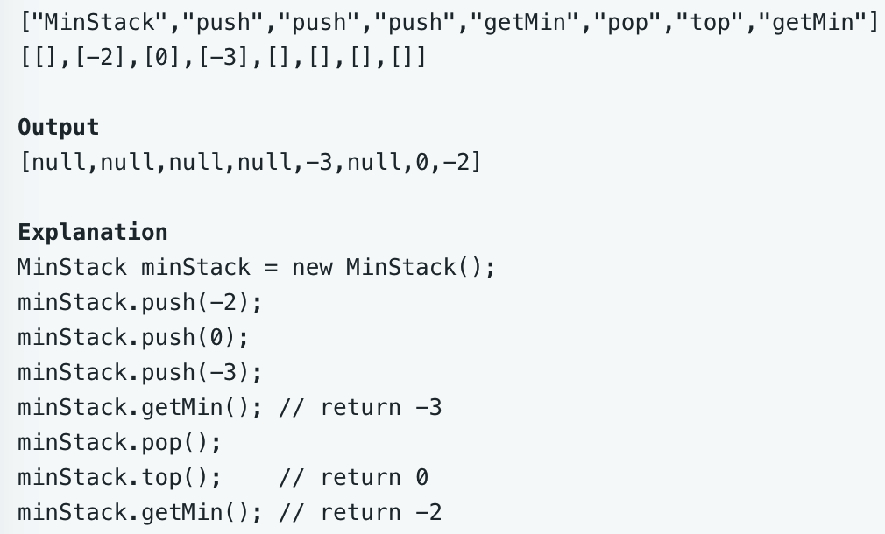

# leetcode t155
- 设计一个能返回最小值的栈
- eg
    - 

# 思路1
- 使用2个栈data和min，2个栈中的元素个数相同
- data入栈时，min同时也入栈，如果val < min栈顶元素，min入栈val，否则入栈min栈顶元素
- 出栈时，2个栈同时出栈
- 时间复杂度O(N), 空间复杂度O(N)

# 方法2
- 使用2个栈data和min，2个栈中的元素个数可能不同
- data入栈时，如果val <= min栈顶元素，min入栈val，否则不入栈
- 出栈是，data栈顶元素==min栈顶元素，min出栈
- 时间复杂度O(N), 空间复杂度O(N)