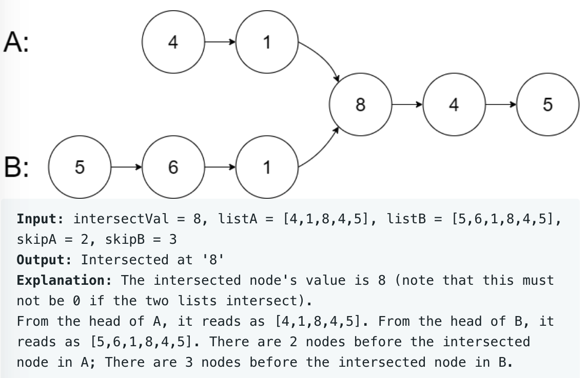

# leetcode t160
- 两个单链表的交点
- 若果链表没有交点，返回null
- eg
    - 

# 思路1
- 使用2个指针p1, p2
- p1走到底时，从headB开始继续遍历
- p2走到底时，从headA开始继续遍历
- 循坏要求p1或者p2不能同时为null
- 循环中如果p1==p2，返回交点
- 本质上，让长链表先走长度差，然后2个链表再同时遍历，找到交点
- 时间复杂度O(N), 空间复杂度O(1)