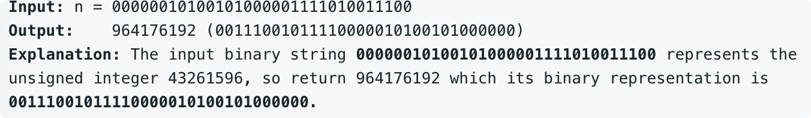

# leetcode t190
- 把32位整数的二进制翻转
- eg,
    - 
    
# 方法1
- 逐个位置互换值
- 时间复杂度O(16), 空间复杂度(1)

# 方法2
- 按位重新生成reverse后的数字
- 时间复杂度O(32), 空间复杂度(1)

# 方法3
- 先交换左16位和右16位
- 再在16位内部交换左边8位和右边8位
- 再在8位内部交换左边4位和右边4位
- 再在4位内部交换左边2位和右边2位
- 再在2位内部交换左边1位和右边1位
- 交换借宿后，完成了对称互换
- 时间复杂度O(5), 空间复杂度O(1)

