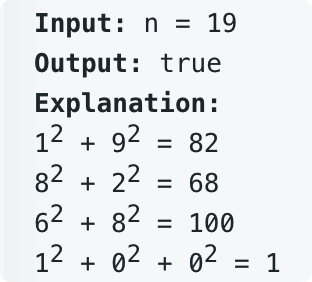

# leetcode t202
- 判断一个正数是否是快乐数
- 变换规则
    - 
- 如果变换中sum=1，是快乐数，如果sum重复循坏，不是快乐数字

    
# 方法1
- 使用set记录中间产生的sum，如果sum重复，返回false
- sum =1, 返回true
- 任意32位正数，最多循环20次，就会有结果
- 时间复杂度O(1), 空间复杂度O(1)

# 方法2
- 查看sum是否重复，和链表是否有环类似
- 使用快慢指针，指针相等时，代表有环
- 时间复杂度O(1), 空间复杂度O(1)

# 方法3
- 任意数字最多经过4次变换，sum 就会 <= 100
- 因此只用先统计100以内的快乐数，把元素自变换到100以内，查表
- 时间复杂度O(1), 空间复杂度O(1)
