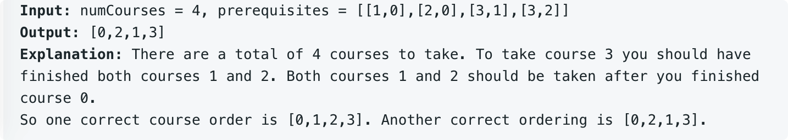

# leetcode t210
- 上课的顺序
- 给定数组int[N][2] prerequisites, 表示上课的依赖，上int[i][0]，之前必须先上int[i][1]
- 给定课程的数量numCourses，课程标号从0,1,...,numCourses-1
- 返回一种正确的上课顺序，如果不存在返回空数组
- eg,
    - 
    
    
# 方法1
- 把原数据转成有向图的形式
- 深度优先遍历图的每个节点，看是否有环
- 使用数组记录遍历过程中走过的点，判断是否有环
- 深度遍历时，无环则加入到结果集，返回上一层
- 最终把结果集中的节点倒序输出
- 时间复杂度O(V+E),V是顶点的数量，E是边的数量，空间复杂度O(V+E)

# 方法2
- 图的拓扑排序
- 找到顶点的入度
- 先把入度为0的点加入队列，弹出一个点，加入到结果集，去掉这个出发的边，更新剩下的点的入度
- 节点加入的书序就是上课的顺序
- 时间复杂度O(V+E),V是顶点的数量，E是边的数量，空间复杂度O(V+E)