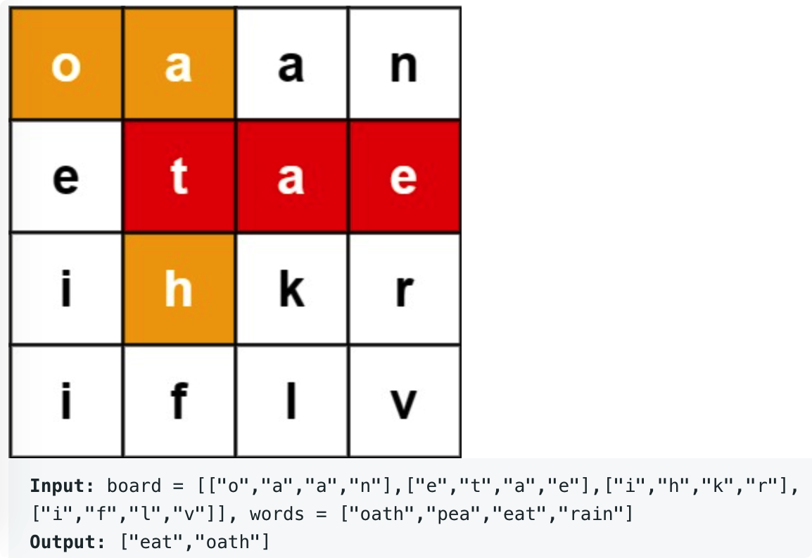

# leetcode t212
- 是t79的升级版
- 在矩阵中检索字符串
- 矩阵中只包含小写字母，给定的字符串了列表也只包含小写字母
- 矩阵中不能走重复路径
- eg,
    -  
   
# 方法1
- 遍历矩阵的每一个位置，以该位置为起点，深度优先遍历，匹配1个单词
- java实现耗时1432ms

# 方法2
- 遍历矩阵的每一个位置，以该位置为起点，深度优先遍历
- 使用前缀树记录words
- 每次匹配到一个单词后，就把单词从前缀树中删掉，减少后面的匹配次数
- java实现耗时62ms

# 方法3
- 思路和方法2一样
- 在遍历过程中使用前缀树的根节点往下遍历，不再使用search函数检索这个path
- java实现耗时19ms