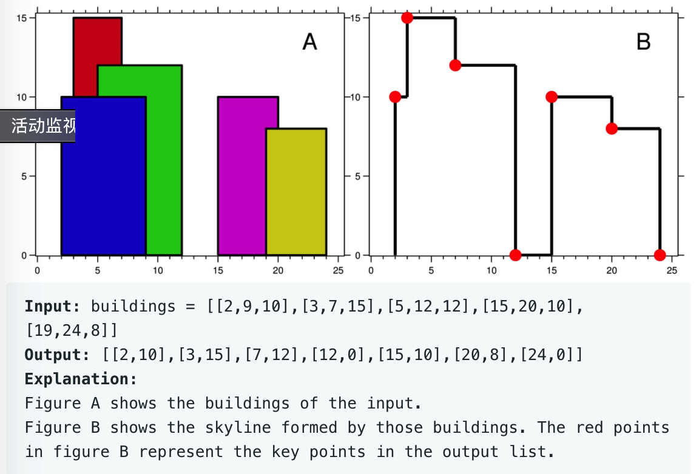

# leetcode t218
- 大楼的天际线
- 给定3元组(start, end, height)表示大楼，输入3元组数组，输出大楼的天际线
- 输入的高度大于0，输入的大楼长度>0
- 输出天际线的关键点
- eg,
    - 
    
# 方法1
- 将原始输入，转换为二元组，加入时的高度为负数，退出时的高度为正数
- 对二元素进行排序
- 按照横坐标进行排序，横坐标相等时，再按照高度进行排序，高度低的排在前面
- 特殊情况
    - 1. 在同一坐标添加时，把高度大的排在前面，高度大的转为负数会，更小，会排在前面
    - 2. 在同一坐标退出时，把高度小的排在前面，高度小的，正数值小一些，排在前面
    - 3. 在同一坐标一个添加，一个退出时，把添加的排在前面，退出的排在后面，添加的高度是负数，退出的事正数，排在前面
- 遍历排序后的二元组，使用最大堆，找到已经加入到堆中元素的最大值，加入时，如果高度时负数，转为正数后，添加到堆，如果高度是正数，从堆中直接删除
- 堆中会存在重复的元素，每次添加和操作都会进行堆进行增删操作，加入数量过多时，堆的大小扩容也需要时间
- 时间复杂度O(N*log(N)), 空间复杂度O(N)

# 方法2
- 方法1中堆中会存在重复的元素，每次添加和操作都会进行堆进行增删操作，加入数量过多时，堆的大小扩容也需要时间
- 自己实现堆，对堆中的重复元素，使用cnt进行计数，减少对堆的操作
- 时间复杂度O(N*log(N)), 空间复杂度O(N)

# 方法3
- 思路和方法1一致
- 使用TreeMap代替堆进行高度排序，key是高度，value是次数，key是唯一的，重复的key使用value进行计数
- TreeMap中不能包含重复元素，因此相同高度进行重复操作时，需要统计次数
- 使用TreeMap的value进行计数
- 由于使用了value进行计数，当对重复的高度进行操作时，只需要操作value即可，减少了直接对treeMap进行增删的操作
- 时间复杂度O(N*log(N)), 空间复杂度O(N)
