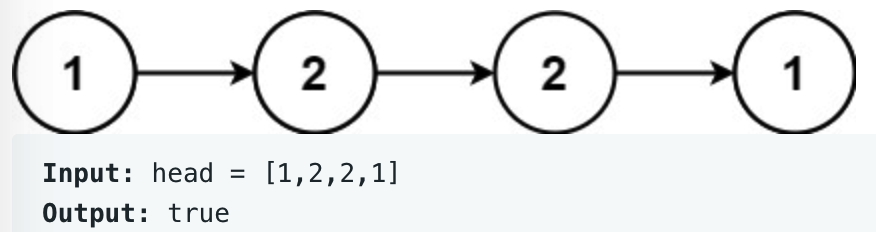

# leetcode t234
- 链表是否回文
- 输入链表无环
- eg,
    - 
    
# 方法1
- 使用快慢指针，找到上中位点
- 把右半部分压栈
- 对比左边和右边是否一致
- 时间复杂度O(N), 空间复杂度O(N)

# 方法2
- 使用快慢指针，找到上中位点
- 逆序右半部分
- 对比左边和右边是否一致
- 恢复右半部分
- 时间复杂度O(N), 空间复杂度O(N)
