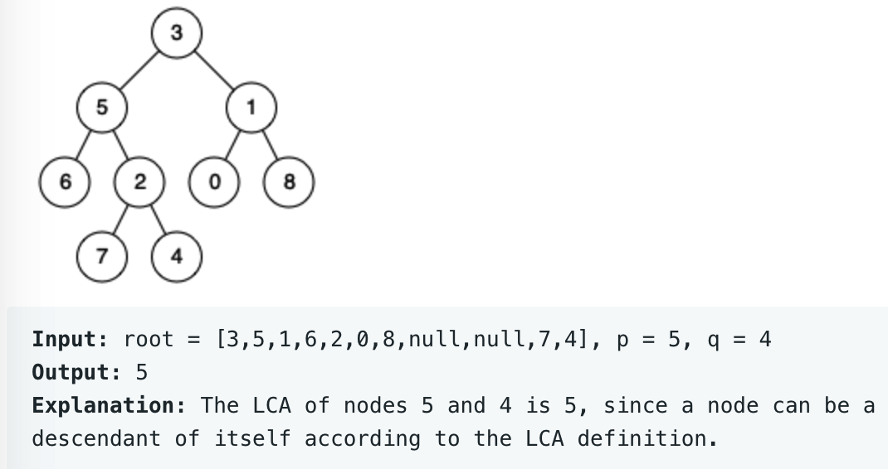

# leetcode t236
- 2节点在二叉树中的最近公共祖先
- eg,
    - 
    
# 方法1
- 后续遍历二叉树
- 如果当前节点是null，或者当前节点是p或者q，直接返回
- 否则，取左右子树的信息left和right
- left和right同时为空，返回null
- left和right有一个为空，返回不为空的那个，不为空的可能是p或q的一个，也可能就是最近公共祖先
- left和right都不为空，说明p和q分别在当前节点的左右子树上，返回当前节点
- 时间复杂度O(N), 空间复杂度O(1)
