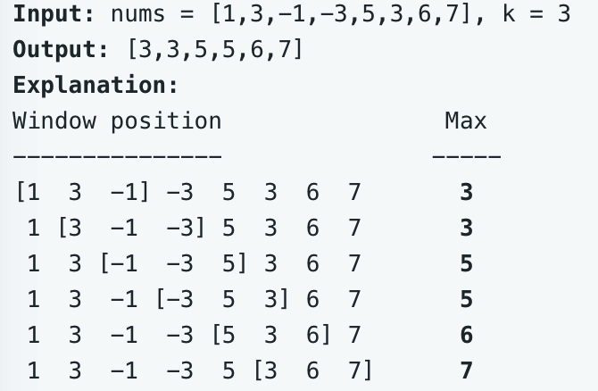

# leetcode t239
- 滑动窗口内的最大值
- eg,
    - 
    
# 方法1
- 使用TreeMap排序， key是数组的值，value是对应的数组index
- 初始时，加入k个元素，获取第一个窗口内的最大值
- 循环，每次加入当前元素，弹出 i-k位置的窗口外的值，再找到窗口内的最大值
- TreeMap的key不会重复，每次有重复的key加入时，新的key的index会覆盖旧的index，即窗口内最新的值会覆盖旧的值
- 时间复杂度O(N*log(k)), 空间复杂度O(k)
- java实现耗时256ms

# 方法2
- 使用单调双端队列，队列内的元素保持不严格的单调递减，新元素从队列尾部加入，窗口内的最大元素是队列的头部的第一个元素
- 新的元素加入到队列如果小于队列尾部的元素，尾部元素出队列，直到尾部元素<=当前要加入的元素
- 队列内存储数组元素的索引
- 如果队列头部的元素超过了窗口范围，头部元素出队列
- 如果元素相等，都要依次进入队列
- 时间复杂度O(N), 空间复杂度O(k)
- java实现耗时26ms