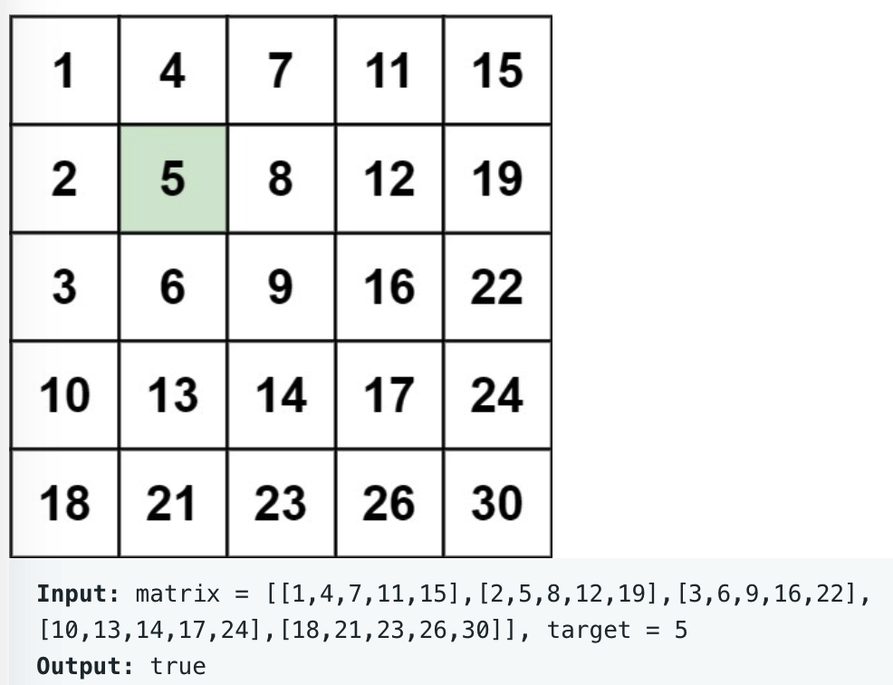

# leetcode t240
- 矩阵中是否存在某个元素
- 给定矩阵，同一行中从左往右递增，同一列从上往下递增
- eg,
    - 
    
# 方法1
- 从矩阵的右上角开始遍历
- 当前元素 = target, return true
- 当前元素 < target, i++, 走向同一列下一行
- 当前元素 > target, j--, 走向同一行左边
- 从矩阵左上角出发，确定了唯一的方向，即向左走寻找更小的值，向下走寻找更大的值
- 时间复杂度O(m+n), 空间复杂度O(1)