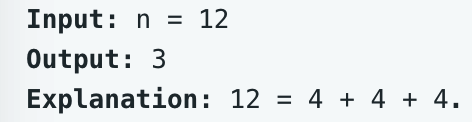

# leetcode t279
- 数字n可以由1^2, 2^2, 3^2 ... 这些数字累加得来，可重复使用，求要使用的最少的数字数量
- eg,
    - 

# 方法1    
- 使用dp数组，dp[i]表示i的答案，依次记录好1...n的dp
- dp[n]的值是 min(dp[n-1], dp[n-4], dp[n-9], ... ) + 1
- 时间复杂度O(N*sqrt(N)), 空间复杂度O(N)
- java实现耗时32ms

# 方法2
- 把n当做根节点，分解成多叉树，节点是 n-i^2, 求解到达0的最短高度即可
- 如果某个节点之前到达过，那么之前的方案一定是更优的，当前节点不用再加入到下一层中
- 时间复杂度O(N*sqrt(N)), 空间复杂度O(N*sqrt(N))，最多N层，每层sqrt(N)个节点
- java实现耗时7ms

# 方法3
- 数学解法
- 拉格朗日四平方和定理：https://zh.wikipedia.org/wiki/%E5%9B%9B%E5%B9%B3%E6%96%B9%E5%92%8C%E5%AE%9A%E7%90%86
- 每个正整数都可以表示为4个整数的平方和
- 勒让德3平方和定理：https://en.wikipedia.org/wiki/Legendre%27s_three-square_theorem
- 当 n != 4^a*(8b+7)时，n可以表示成3个整数的平方和
- 再判断n是否是一个数的平方，或者枚举判断n是否是2个数的平方
- 时间复杂度O(sqrt(N)), 空间复杂度O(1)
- java实现耗时1ms
