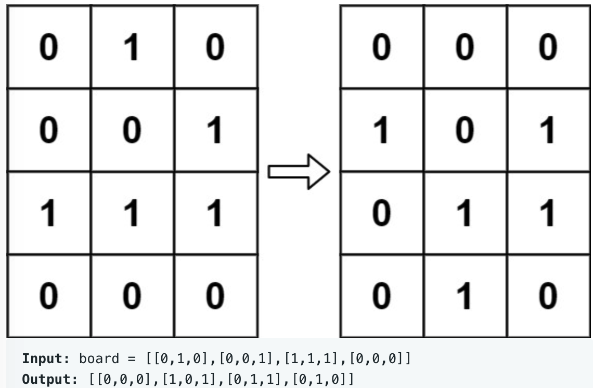

# leetcode t289
- 矩阵中0，1取值的演变游戏
- 给定矩阵，矩阵中的取值是0或者1，根据规则推算下一步的状态
- 规则
    - 统计某个点周围的8个格子中1的个数num
    - 如果该点为1，
        - num = 2或者3， 下一步该点的值继续是1
        - num < 2, 下一步该点的值是0
        - num > 3, 下一步该点的值是0
    - 如果该点的值是0，
        - num = 3, 下一步该点的值是1
        - 其他情况下该点的值是0
- 矩阵中的值是同时改变的
- eg,
    - 

# 方法1    
- 每个格子里的类型是整型，利用整型的倒数第2个bit存放新生成的信息
- 依次遍历矩阵，查看每个格子周围8个格子中1的个数
- 时间复杂度O(M*N), 空间复杂度O(1)