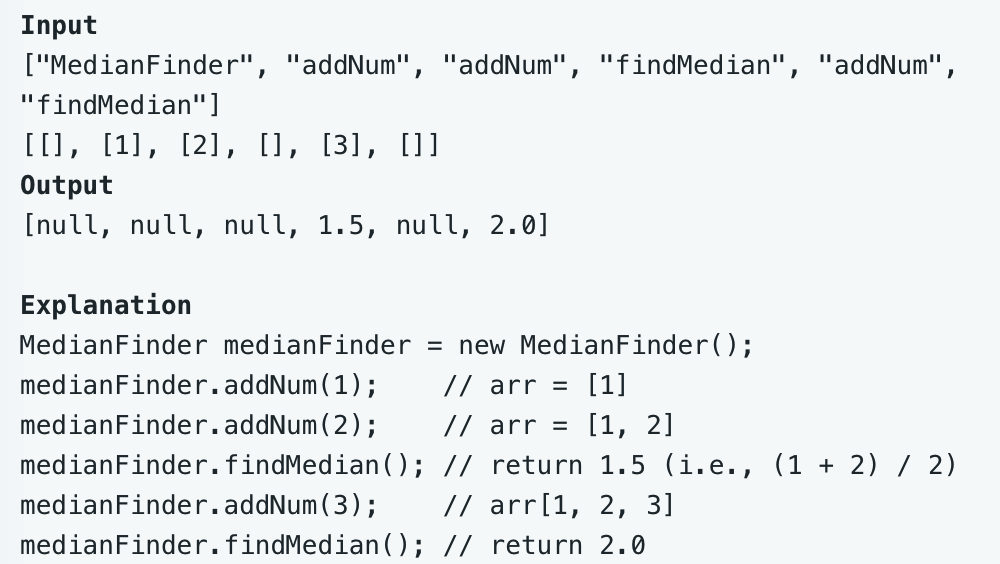

# leetcode t295
- 给定一个数据流，实时返回数据流的中位数
- 如果数字总数为偶数，返回中间2个数的平均值；奇数，返回中位数
- eg,
    - 

# 方法1    
- 使用最大堆和最小堆，如果总个数是偶数，2个堆的元素个数相等，如果是奇数，最大堆的元素个数比最小堆多一个
- 最大堆的存放前半部分，堆顶是前半部分的最大值；最小堆存放后半部分，堆顶元素是后半部分的最小值
- 新元素加入的时候，先加入最小堆，再把最小堆的堆顶弹到最大堆，保证最大堆的元素总是比最小堆多，如果最大堆比最小堆多2个元素，把最大堆对顶元素弹回最小堆
- 取median时，如果总个数是偶数，取各自的堆顶元素，取平均值；奇数时，取最大堆的堆顶元素
- 时间复杂度O(N*log(N)), 空间复杂度O(N)