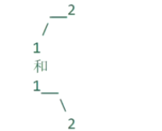

# leetcode t297
- 二叉树序列化和反序列化
- 序列化和反序列化的方式不限制
- eg,
    
    
# 方法1    
- 使用前序遍历序列化
- 序列化时，把叶子节点的左右节点使用"null"代替
- 节点之间使用特定字符串"#"来间隔
- 反序列化时，头结点是第一个位置，后面依次建立左子树和右子树，使用index标记数组的位置
- 时间复杂度O(N), 空间复杂度O(N)

# 方法2    
- 使用后序遍历序列化
- 序列化时，把叶子节点的左右节点使用"null"代替
- 节点之间使用特定字符串"#"来间隔
- 反序列化时，头结点是第一个位置，后面依次建立左子树和右子树，使用index标记数组的位置
- 时间复杂度O(N), 空间复杂度O(N)

# 方法3
- 层序遍历序列化
- 序列化时，把叶子节点的左右节点使用"null"代替
- 节点之间使用特定字符串"#"来间隔
- 反序列化时，新建一个队列，放入新建的当前层的节点，新队列和原始队列同步弹出
- 时间复杂度O(N), 空间复杂度O(N)

# 中序遍历无法进行序列化和反序列化
- eg,
    - 
    - 序列化后都是 null#1#null#2#null