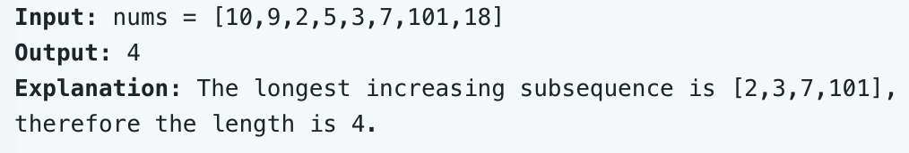

# leetcode t300
- 最长严格递增子序列
- 给定数组，找到严格递增的子序列的长度
- 子序列不要求连续
- eg,
    - 
    
    
# 方法1    
- 使用dp数组，dp[i]表示以nums[i]结尾的最长递增子序列的长度
- 考虑当前位置nums[i], 依次与0~i-1位置相比较，记录最大长度
- 如果nums[i] > nums[j]， i位置是dp[j]+1，否则是1
- 使用最大值变量不断与dp[i]比较，并更新
- 时间复杂度O(N^2), 空间复杂度O(N)
- java实现耗时101ms

# 方法2    
- 使用dp数组，dp[i]表示长度为i的数组的子序列的末尾值，dp数组的值是递增的
- 考虑当前位置nums[i], 使用二分法查找nums[i]在dp数组的位置j, j位置的原始值是长度相等但比nums[i]大的值，更新dp[j]位置的值 = nums[i]
- dp数组中同一长度的位置，使用尾部值更小的来覆盖前面的
- 最终dp数组的有效的不为0的长度就是最长递增子序列
- 二分搜索返回值
    - 找到nums[i]对应的长度的位置index，更新该位置的值为nums[i]
    - 如果nums[i]比数组中所有值都小，返回index=1
    - 如果nums[i]等于数组中的某个值，返回index=相等位置的索引
    - 如果nums[i]介于数组中两个值之间，返回index= 比nums[i]大的第一个位置的索引
    - 如果nums[i]比数组中所有值都大，返回index=maxLen+1
- 时间复杂度O(N*log(N)), 空间复杂度O(N)
- java实现耗时4ms