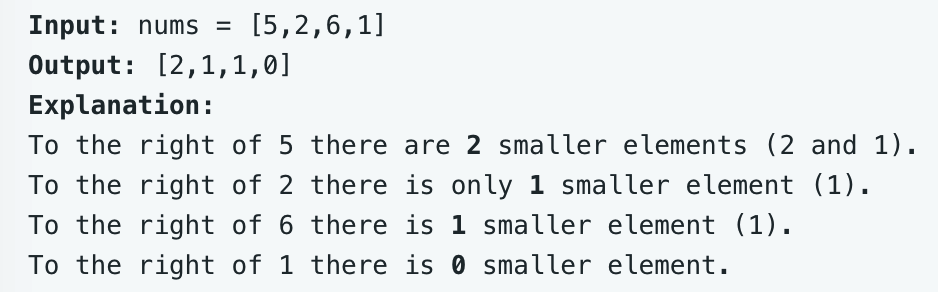

# leetcode t315
- 找到数组每个元素右边比它小的元素个数
- eg,
    - 
    
    
# 方法1    
- 依次遍历每个位置，找到后面比他小的元素数量
- 时间复杂度O(N^2), 空间复杂度O(N)
- java实现超时

# 方法2    
- 递归排序合并左右两个子数组时，会找到左边数组比右边数组大的
- 先局部合并，会找到一部分，再全局排序，会找到一部分，几部分累加就是结果
- 使用归并排序，从小到大排序
- 归并排序的merge过程，合并左右两部分有序子数组时，从后往前合并
- 如果遇到左边的p1位置比右边的p2位置大，那么p1位置可以结算，p2及其左边的位置都比p1位置小
- 初始时每个位置的cnt是0，递归合并时，会不断更新每个位置的cnt
- 由于排序会打乱数组元素的位置，使用Info结构存储数组的值和index
- 时间复杂度O(N*log(N)), 空间复杂度O(N)
- java实现耗时93ms