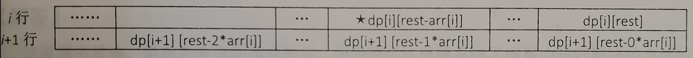

# leetcode t322
- 使用硬币的最少数量
- 给定一个正整数数组代表签的面值，给定目标值，返回组成目标值的最少的钱的数量
- 每种面值的钱的数量是无限的
- eg,
    - coins = [1,2,5], amount = 11， return 3, use 5 + 5 + 1 = 11
    
    
# 方法1    
- 使用递归函数，依次计算每个位置开始要完成left钱数使用的最少硬币个数，向下递归
- 递归函数实现
    - 递归函数表示从当前位置index开始的硬币做成left钱数的需要的最少硬币数量
    - index：当前来到的位置
    - left: 剩余的钱数
    - 如果存在有效方案，返回最少的硬币数量；没有有效方案，返回-1
- java实现超时

# 方法2    
- 方法1中的递归函数有很多次重复计算
- 使用数组缓存结果，减少重复计算
- 使用递归函数，依次计算每个位置要使用的硬币的个数，向下递归
- java实现耗时540ms

# 方法3
- 使用dp，dp[i][j]表示从数组i开始的硬币组成钱数j的最少硬币数量
- 转移方程 dp[i][j] = min( dp[i+1][j-k*nums[i]] + k)
- 转移方程进一步简化 dp[i][j] = min( dp[i+1][j-nums[i]] + 1， dp[i+1][j])
    - 
    - 图中dp[i][j]求解依赖于 dp[i+1][j],dp[i+1][j-coins[i]],dp[i+1][j-2*coins[i]],...
    - 而dp[i][j-nums[i]]求解依赖于dp[i+1][j-coins[i]],dp[i+1][j-2*coins[i]],...
    - 因此dp[i][j]求解依赖于dp[i+1][j] 和 dp[i][j-nums[i]]
- 时间复杂度O(N*aim), 空间复杂度O(N*aim)
- java实现耗时23ms

# 方法4
- 思路和方法3一致
- 转移方程进一步简化 dp[i][j] = min( dp[i+1][j-nums[i]] + 1， dp[i+1][j])
- 对状态进一步压缩，dp[i][j]只依赖于dp[i+1]行，把dp压缩到一行数据
- 时间复杂度O(N*aim), 空间复杂度O(aim)
- java实现耗时13ms

