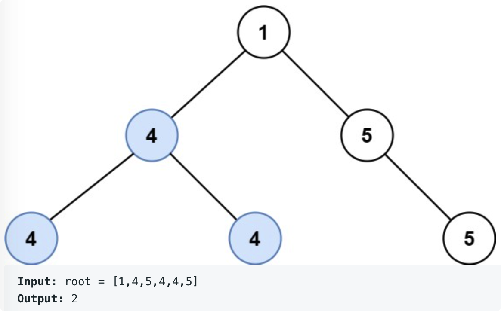

# leetcode t687
- 本题不是高频题
- 给定二叉树，找到路径中的值全是一样的路径，返回这种路径的最大值
- eg
    - 
    - 
    
# 思路
- 遍历二叉树，考虑当前节点为父节点的所有情况
    - 情况1，最长路径和当前父节点无关，出现在左节点上，是左节点的最长路径
    - 情况2，最长路径和当前父节点无关，出现在右节点上，是右节点的最长路径
    - 情况3，最长路径就是当前父节点
    - 情况4，当前路径是从父节点出发往左边的最长路径
    - 情况5，当前路径是从父节点出发往右边的最长路径
    - 情况7，当前路径是从左边到头结点再到右边的路径
- 节点需要返回2个信息
    - 当前节点作为根节点的最长路径
    - 当前节点出发往左边或者往右边的最长路径
- 时间复杂度O(N), 空间复杂度最大为O(N), N是节点个数